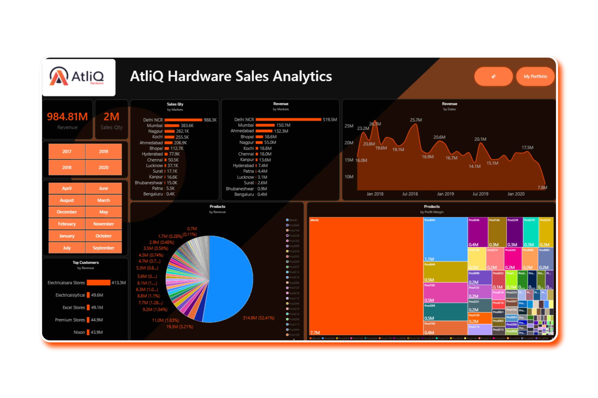

# AtliQ Hardware Sales Analytics

An interactive **Power BI Sales Analytics Dashboard** for analyzing sales performance across markets, products, customers, and time.

## Live Dashboard

**[View Interactive Power BI Dashboard](https://app.powerbi.com/view?r=eyJrIjoiYzc3YmExMTUtMjAyOS00NTU1LWFjZTgtZjk1NGExMzcyZTE0IiwidCI6ImJhZjhjOTk5LWQzY2EtNGY5NC04NjMyLTI3MDU2OTIwZmI1ZSJ9)**

## Dashboard Preview



## Project Overview

This project transforms transactional sales data into an interactive business intelligence dashboard.

The dashboard provides analysis of:

- Revenue
- Sales quantity
- Market performance
- Revenue by market
- Revenue trends over time
- Product revenue contribution
- Product profitability
- Top customers by revenue
- Year and month performance

## Key KPIs

| KPI | Value |
|---|---:|
| Revenue | **984.81M** |
| Sales Quantity | **2M** |

## Business Questions

The dashboard helps answer:

1. How much revenue and sales quantity were generated?
2. Which markets contribute the most revenue?
3. Which markets have the highest sales quantity?
4. How does revenue change over time?
5. Which products contribute the most revenue?
6. Which products have stronger profit margins?
7. Which customers generate the highest revenue?
8. How does performance change across years and months?

## Dashboard Features

### Revenue & Sales KPIs
High-level KPI cards show revenue, sales quantity, and profitability metrics.

### Market Analysis
Revenue and sales quantity are analyzed across different markets.

### Revenue Trend
A time-series view shows how revenue changes over the reporting period.

### Product Analysis
Product visuals show revenue contribution and profit-margin patterns.

### Customer Analysis
The **Top Customers by Revenue** visual identifies customers contributing the most revenue.

### Interactive Filters
Users can filter the report by:

- Year
- Month

## Dataset

The project contains these logical entities:

### Customers
- Customer code
- Customer name
- Customer type

### Date
- Date
- Year
- Month
- Year-month

### Markets
- Market code
- Market name
- Zone

### Products
- Product code
- Product type

### Transactions
- Product code
- Customer code
- Market code
- Order date
- Sales quantity
- Sales amount
- Currency
- Profit margin percentage
- Profit margin
- Cost price

## Data Model

The Power BI model uses a dimensional/star-schema-oriented structure with `Transactions` as the central fact table.

```text
                    Customers
                        |
                        |
Products -------- Transactions -------- Markets
                        |
                        |
                       Date
```

### Fact Table
**Transactions** — sales transactions and numeric business measures.

### Dimension Tables
- Customers
- Products
- Markets
- Date

## Data Preparation

The workflow includes:

1. Loading source data into Power BI.
2. Reviewing and correcting data types.
3. Cleaning and transforming fields where required.
4. Creating relationships between tables.
5. Preparing date attributes for time analysis.
6. Creating DAX measures.
7. Validating totals and visual outputs.

## DAX Measures

Examples of the analytical measures:

```DAX
Total Revenue =
SUM(Transactions[sales_amount])
```

```DAX
Total Sales Quantity =
SUM(Transactions[sales_qty])
```

```DAX
Total Profit =
SUM(Transactions[profit_margin])
```

```DAX
Profit Margin % =
DIVIDE([Total Profit], [Total Revenue])
```

> These are representative examples. The actual measure names and business definitions should match the Power BI model in the repository.

## Tools & Technologies

- **Power BI Desktop** — dashboard and visualization
- **Power Query** — data transformation
- **DAX** — calculations and KPIs
- **SQL** — source data/database analysis
- **Git & GitHub** — version control and documentation

## Repository Structure

```text
AtliQ-Hardware-Sales-Analytics/
│
├── README.md
│
├── powerbi/
│   ├── AtliQ-Hardware-Sales-Analytics.pbip
│   ├── AtliQ-Hardware-Sales-Analytics.Report/
│   └── AtliQ-Hardware-Sales-Analytics.SemanticModel/
│
├── data/
│   └── db_dump_version_2.sql
│
├── assets/
│   └── Dashboard.png
│
└── docs/
    └── data-model.png
```

## Skills Demonstrated

- Power BI
- Power Query
- DAX
- Data Modeling
- Star Schema
- SQL
- Business Intelligence
- Data Visualization
- Sales Analytics
- KPI Development
- Interactive Dashboard Design
- GitHub Documentation

## Future Improvements

- Year-over-year growth measures
- Additional profitability KPIs
- Market/region drill-through pages
- Customer segmentation
- Product performance ranking
- Advanced tooltip pages
- Forecasting
- Automated data refresh
- Additional dashboard navigation

## Author

**Your Name**

[LinkedIn](YOUR_LINKEDIN_URL) · [GitHub](YOUR_GITHUB_PROFILE_URL)

---

**Business Problem → Data Preparation → Data Model → DAX Measures → Dashboard → Interactive Analysis → Business Insights**
